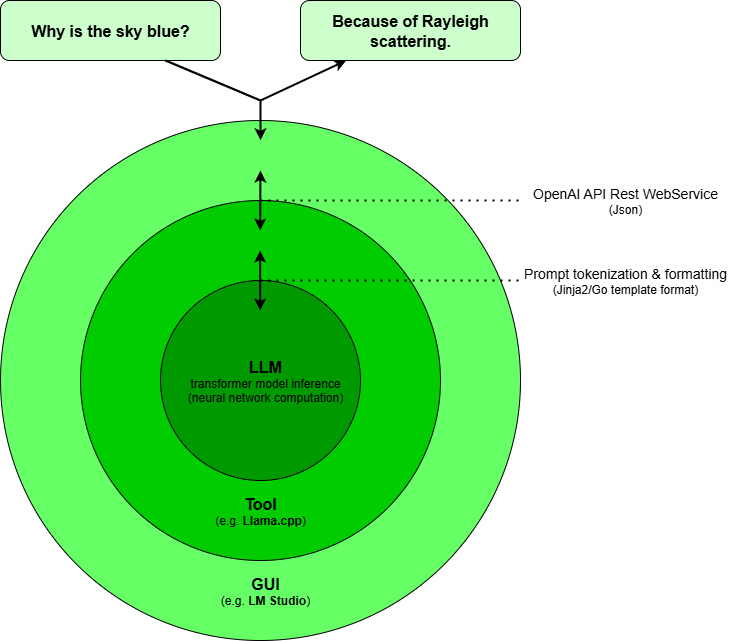

# LocalAI

## Abstract

This project contains a template directory structure to run LLMs locally (**OpenAI API** compatible servers and clients).

## Model formats

**LLM** consist of tensors and metadata stored in binary files designed for fast loading and inference on consumer-grade hardware.
There are at least 2 popular file formats:

  - Ollama: A **LLM** is stored in multiple **BLOB** (binary large object) files, including 1 file containing the <b>*Modelfile*</b>.
  This file format is used by **[Ollama](https://ollama.com/)**
  - GGUF: A **LLM** in **GGUF** (GPT-Generated Unified Format) is a single binary file that also includes the <b>*chat_template*</b>.
  The **GGUF** format is popular because of **[HuggingFace](https://huggingface.co/)**, a major hub of the **AI** community.
  This file format is used by **[LM Studio](https://lmstudio.ai/)** and **[Llama.cpp](https://github.com/ggml-org/llama.cpp)**.
 
This is important as the file formats are not easily interchangeable between different tools.
And as **LLM**s are quit large downloads one should think first which tool will be used and which file format is required.
One issue to consider is, the **GGUF** file format seems to be more widely used, so the tool support for new **LLM**s is
likely earlier available as for the **Ollama** file format.

**Hint!** You can share **LLM**s between different tools without downloading the same **LLM** multiple time by using symbolic links.
Just symlink the downloaded **GGUF** file from one path to another path, e.g. assuming a download of **Gpg-Oss-20B** with **[LM Studio](https://lmstudio.ai/models/openai/gpt-oss-20b)** into file <b>*D:\LocalAI\LMStudio\Users\.lmstudio\models\lmstudio-community\gpt-oss-20b-GGUF\gpt-oss-20b-MXFP4.gguf*</b> use it with **Llama.cpp** from the file <b>*D:\LocalAI\Llama.cpp\Models\gpt-oss-20b\gpt-oss-20b-MXFP4.gguf*</b> by:

```
mklink D:\LocalAI\Llama.cpp\Models\gpt-oss-20b\gpt-oss-20b-MXFP4.gguf D:\LocalAI\LMStudio\Users\.lmstudio\models\lmstudio-community\gpt-oss-20b-GGUF\gpt-oss-20b-MXFP4.gguf
```

### Conversion

An example how to convert a **LLM** in **GGUF** file format is shown in the **[Ollama](./Ollama/ReadMe.md)** chapter.

## Processing

A few words on how a <b>*user message*</b> such as e.g. <b>*Why is the sky blue?*</b> gets processed to an answer such as e.g. <b>*Because of Rayleigh scattering.*</b>.
This is important to understand how a **LLM** represents the input internally to process it, especially in conjunction with a **Modelfile** or **chat_template** as they may contain a default <b>*system message*</b> such as <b>*You are a helpful assistant!*</b>. 



The <b>*user message*</b>, which may be multi-media not just text, is sent to the **LLM**:

1. The user enters the <b>*user message*</b> in some kind of user interface, that may be a commandline or a **GUI** such as **Msty** or **LM Studio**.
2. The message gets converted by the interface into **[Json](https://en.wikipedia.org/wiki/JSON)** format that is compatible with the **OpenAI API** Rest WebService standard.
3. The **LLM** provider such as **Ollama** or **Llama.cpp** parses and transforms that **Json** into an internal format that is compatible with the specific **LLM** used.
This is typically depending on a correct **Modelfile** in **Go** template syntax (Ollama) or **chat_template** in **Jinja2** template syntax (Llama.cpp) template
so the provider knows how to *format* and *tokenize* the <b>*user message*</b> into the syntax understood by the **LLM**. 
That's why when a **LLM** get published which supports new features (e.g. **Gpt OSS 20B** supporting reasoning with tool and function calling), the
provider needs to be updated to correctly *format* the <b>*user message*</b> into the **LLM** specific syntax (so the LLM can respond on how the tool or function should be called).
4. The **LLM** *calculates* the most likely response according to the *formatted* and *tokenized* <b>*system message*</b> and <b>*user message*</b>.

The response, the <b>*assistant*</b> message is then returned to the user interface.

### Template format

The <b>*user message*</b> is *formatted* and *tokenized* in a way that allows the **LLM** to calculate the most likely response.
*Most likely* because an **LLM** neither understands what the user is talking about nor the meaning of its own response — it simply works with probabilities of data sequences.
All forms of input (words, tones, pixels, etc.) are converted into numbers — more precisely, into multi-dimensional vectors of numbers, called <b>*embeddings*</b>.
These numerical vectors represent the data in a way that captures its meaning or features, allowing the model’s neural network to process and reason about it mathematically.

In detail:

  - Text → Tokenized into words/subwords → each token is represented as a vector (embedding).
  - Speech/sound → Transformed into numerical features (e.g. spectrograms) → vectors.
  - Images → Pixel data or extracted features → vectors.

For this *tokenization* two template formats exist, the **Go** and the **Jinja2** template format.
This is important because the two formats are not fully compatible, that is **Jinja2** supports iterations which **Go** (the **Ollama** parser is
written in the Go language) does not support.
So using a **Jinja2** template may require rework of the processing logic in addition to translation to a **Go** template.

#### Go

For example:

```go
{{- if .System }}
<|system|>
{{ .System }}
<|end|>
{{- end }}
<|user|>
{{ .Prompt }}
<|end|>
<|assistant|>
```

  - <b>*.System*</b> and <b>*.Prompt*</b> are variables provided to the template.
  - The <b>*if*</b> block ensures the <b>*system message*</b> is optional.
  - Tags like <b>*<|user|>*</b> and <b>*<|assistant|>*</b> are special tokens that the model understands.

#### Jinja2

For example:

```

<|system|>
{{ system }}
<|end|>

<|user|>
{{ user }}
<|end|>
<|assistant|>
```

  - <b>*system*</b> and user are variables in the input context.
  - Similar structure to **Go**, but uses **Jinja2** syntax: <b>**</b> for logic and <b>*{{ }}*</b> for variables.

### Llama.cpp

With **Llama.cpp** it is quite easy to observe how the messages are *formatted* and *tokenized* by the options <b>*--verbose-prompt*</b> and for more details the <b>*--verbose*</b> option, e.g.:

```bash
llama-cli --model "Mistral 7B Instruct v0.3\Mistral-7B-Instruct-v0.3-Q4_K_M.gguf" --ctx-size 32768 --n-gpu-layers 40 --jinja --verbose --verbose-prompt --prompt "Why is the sky blue?" --system-prompt "You are a scientific advisor!"
```

The messages logged to <b>*stderr*</b> for processing the <b>*user message*</b> <b>*Why is the sky blue?*</b> and the <b>*system message*</b> 
<b>*You are a scientific advisor!*</b> will include:

#### Metadata

After loading the **LLM** some configuration details (e.g. CUDA hardware, quantization, context size, training parameters, ...)  will be outputted.

#### Tensor

Details about the tensors (weights) loaded from a GGUF-format model file into memory during model initialization is outputted
on a block (layer) basis for transformer models.

#### Tokenization

*Tokenization* includes that the prompt is embedded in control tokens, which includes a <b>*EOG*</b> (end of generation) token to 
signal the end of the generation.
A token like e.g. <b>*<|eot|>*</b> in the template indicates that.

The <b>*user message*</b> and the optional <b>*system message*</b> (which may come from the **Modelfile** or **chat_template** templates if nothing is
supplied by a commandline option) is *tokenized* so the **LLM** understand how to process it.
With the e.g. **Mistral** **LLM** the *fromatted* prompt:

```
"[INST] You are a scientific advisor!
Why is the sky blue? [/INST]"
```

gets *tokenized* to:

```
[ '<s>':1, '[INST]':3, ' ':29473, ' You':1763, ' are':1228, ' a':1032, ' scientific':11237, ' advis':15077, 'or':1039, '!':29576, ' 
':781, 'Why':8406, ' is':1117, ' the':1040, ' sky':7980, ' blue':5813, '?':29572, ' ':29473, '[/INST]':4 ]
```

probably more readable this way:

```
main: number of tokens in prompt = 19
     1 -> '<s>'
     3 -> '[INST]'
 29473 -> ' '
  1763 -> ' You'
  1228 -> ' are'
  1032 -> ' a'
 11237 -> ' scientific'
 15077 -> ' advis'
  1039 -> 'or'
 29576 -> '!'
   781 -> '
'
  8406 -> 'Why'
  1117 -> ' is'
  1040 -> ' the'
  7980 -> ' sky'
  5813 -> ' blue'
 29572 -> '?'
 29473 -> ' '
     4 -> '[/INST]'
```

#### Inferencing

The response is then *predicted* by the **LLM**:

```
n_past = 19
n_remain: -2
 Theeval: [ ' The':1183 ]
n_past = 20
n_remain: -3
 skyeval: [ ' sky':7980 ]
n_past = 21
n_remain: -4
 appearseval: [ ' appears':8813 ]
n_past = 22
n_remain: -5
 blueeval: [ ' blue':5813 ]
n_past = 23
n_remain: -6
 dueeval: [ ' due':3708 ]
n_past = 24
n_remain: -7
 toeval: [ ' to':1066 ]
n_past = 25
n_remain: -8
 aeval: [ ' a':1032 ]
n_past = 26
n_remain: -9
 processeval: [ ' process':2527 ]
n_past = 27
n_remain: -10
 calledeval: [ ' called':2755 ]
n_past = 28
n_remain: -11
 Rayeval: [ ' Ray':9720 ]
n_past = 29
n_remain: -12
leeval: [ 'le':1059 ]
n_past = 30
n_remain: -13
igheval: [ 'igh':1724 ]
n_past = 31
n_remain: -14
 scatteringeval: [ ' scattering':22403 ]
...
```

that results in the formatted response to the user:

```
The sky appears blue due to a process called Rayleigh scattering. As sunlight reaches Earth, it is made up of different colors, which are actually different wavelengths of light. Shorter wavelengths, such as violet and blue, are scattered in all directions more than longer wavelengths, such as red and yellow.

However, our eyes are more sensitive to blue light and less sensitive to violet light, and the atmosphere scatters more blue light than violet. As a result, the sky appears blue to our eyes.

At sunrise and sunset, the light has to pass through a lot of atmosphere, and the shorter blue wavelengths are scattered out more than the longer red and yellow wavelengths. This is why the sky can appear red or orange during these times. Similarly, when the sun is low, the light has to pass through more air, increasing the amount of scattering.

On a clear day, the scattered blue light is evenly distributed in all directions. However, during sunrise or sunset, the scattered light is concentrated in the horizontal direction, which is why the sky appears red or orange during these times.

Overall, the color of the sky is a beautiful example of how light interacts with our atmosphere and how our perception of color plays a role in the way we experience the world.
```

## VRAM Limitation

Running large language models (LLMs) on consumer-grade GPUs, such as the NVIDIA RTX 4090 with 16 GB of VRAM, presents significant challenges due to memory constraints.
The article **[Context Kills VRAM: How to Run LLMs on Consumer GPUs](https://medium.com/@lyx_62906/context-kills-vram-how-to-run-llms-on-consumer-gpus-a785e8035632)** explores these challenges, focusing on the critical tradeoff between model size and context window size.
This tradeoff arises because model weights can be compressed, but the **KV cache** (Key-Value cache), which stores attention vectors for processed tokens, scales linearly with context length and is harder to compress.
Below, we summarize the article’s insights into VRAM limitations, focusing on the tradeoffs between CPU and GPU memory, VRAM usage calculations, available mitigations, key takeaways, and strategies for efficient VRAM and model size planning.

### Tradeoffs Between CPU and GPU Memory

Consumer GPUs, typically equipped with 8–16 GB of **VRAM**, offer substantial computational power for LLM inference but are limited by their memory capacity.
When the combined memory demands of the model weights and the KV cache exceed available VRAM, the system resorts to offloading parts of the computation to CPU RAM, a process known as <b>*spilling*</b>. 
This hybrid CPU+GPU mode, supported by frameworks like **Ollama**, allows larger models to run by leveraging CPU RAM’s larger capacity (often 32–64 GB or more). However, this comes with significant performance penalties due to PCIe latency, as data must traverse the bus between CPU and GPU, slowing inference dramatically.

The article provides benchmark results using the `qwen3:14b` model on an RTX 3060 (12 GB VRAM), illustrating a U-shaped performance curve.
Pure CPU inference yields \~4.6 tokens/sec, while low GPU usage (e.g., 10–20% of layers on GPU) drops to \~2.6 tokens/sec due to PCIe transfer overhead. Performance only surpasses CPU-only speeds at around two-thirds GPU usage, reaching 32 tokens/sec at full GPU utilization.
For larger models like `qwen3:32b`, hybrid mode becomes beneficial earlier (at \~30% GPU usage) because heavier layers yield greater computational gains per transfer.
However, hybrid mode’s primary advantage is enabling models that wouldn’t fit in VRAM alone, even if it’s slower in some configurations.
Future technologies like PCIe 5.0 or NVLink may reduce these penalties, but for now, users must carefully balance GPU and CPU usage to avoid the "performance cliff" caused by spilling.

### Calculation of VRAM Usage Including KV Cache

VRAM usage during LLM inference consists of a fixed component (model weights and system overhead) and a variable component (KV cache) that grows with context length.
The article provides a detailed formula for estimating VRAM usage:

```
VRAM(N) [GB] = (P × b_w + 0.55 + 0.08 × P) + N × (2 × L × d/g × b_kv / 1024³)
```

Where:
- **P**: Model parameters in billions (e.g., 7 for a 7B model)
- **b_w**: Bytes per weight (e.g., 0.57 for Q4_K_M quantization)
- **0.55**: CUDA/system overhead (in GB)
- **0.08 × P**: Scratchpad activations (temporary tensors, in GB)
- **N**: Context length (tokens)
- **L**: Number of transformer layers
- **d**: Hidden dimension size
- **g**: Grouped Query Attention (GQA) factor (query heads ÷ KV heads)
- **b_kv**: Bytes per KV scalar (typically 2 for FP16)

#### Fixed VRAM Cost
The fixed cost includes:
- **Model weights**: `P × b_w` (e.g., for a 7B model in Q4_K_M, 7 × 0.57 ≈ 4.34 GB)
- **CUDA overhead**: ~0.55 GB for buffers and workspace
- **Scratchpad**: ~0.08 × P GB for temporary tensors

For example, the `Qwen 2.5 7B` model in Q4_K_M uses approximately 5.33 GB (measured) versus 5.50 GB (predicted), confirming the formula’s accuracy.

#### KV Cache Calculation
The KV cache stores key and value vectors for attention, growing linearly with context length (`N`). Its memory usage is calculated as:

```
KVCache(N) [GB] = N × 2 × L × d/g × b_kv / 1024³
```

For `Qwen 2.5 7B` (L = 32, d = 3584, g = 4, b_kv = 2), the KV cache consumes \~0.109 MiB/token, closely matching measured values (\~0.110 MiB/token).
For a 4096-token context, this adds \~0.45 GB, but at 32K tokens, it grows to \~3.5 GB, significantly impacting VRAM availability.
For larger models or longer contexts, the KV cache can dwarf the fixed cost, making it the primary VRAM bottleneck.

### Mitigations Available

Several techniques mitigate VRAM limitations, enabling larger models or longer contexts on consumer GPUs:

1. **Quantization**:
    - Quantization reduces model weight precision (e.g., from `FP16` to `8-bit` or `4-bit` integers), shrinking model size by 50–75%. The `Q4_K_M` format, using \~0.57 bytes per parameter, balances size and accuracy effectively. For instance, a 14B model in `Q4_K_M` fits within 12 GB VRAM but leaves limited room for context (~4K tokens).
    - Recent advances extend quantization to the KV cache, reducing its memory footprint. However, the impact on generation quality is still under evaluation.
2. **Attention Optimizations**:
    - **Grouped Query Attention (GQA)**: Shares key-value projections across query heads, reducing KV cache size. GQA, used in models like `LLaMA-3` and `Qwen`, enables longer contexts within the same VRAM budget compared to Multi-Head Attention (MHA).
    - **Sliding Window Attention (SWA)**: Limits attention to a fixed window of recent tokens (e.g., 4096 tokens in `Mistral`), with only a few layers retaining global attention. This caps KV cache growth, enabling longer contexts.
    - **Multi-Latent Attention (MLA)**: Used in `DeepSeek-R1 (671B)`, MLA compresses KV tensors into a smaller latent space (e.g., 128 dimensions vs. 16384), reducing memory usage to ~7% of the original, supporting large contexts on limited VRAM.
3. **Unified Memory and Future Technologies**:
    - Frameworks like **Ollama**’s hybrid mode combine GPU VRAM and CPU RAM, expanding effective memory but introducing PCIe latency. Future advancements like **PCIe 5.0**, **NVLink**, or **shared HBM memory** could reduce transfer penalties, making hybrid setups more viable.

### Takeaways: Configuration Tuning Options

The article emphasizes several tuning strategies to optimize LLM performance within VRAM constraints:
- **Monitor Usage**: Tools like `nvidia-smi` and `ollama ps` help detect VRAM saturation or CPU spilling (indicated by high VRAM usage and low GPU utilization).
- **Adjust Context Length**: Set `num_ctx` in **Ollama** to match desired context length, as the default (4096 tokens) may limit models capable of more.
- **Optimize Layer Placement**: In hybrid mode, assign enough layers to the GPU (via `num_gpu` in **Ollama**) to surpass the performance tipping point where GPU acceleration outweighs PCIe latency.
- **Batch Size**: For chat applications, keep batch size = 1 to minimize VRAM usage unless excess memory is available.
- **Avoid Spilling**: Ensure the model and context fit entirely in VRAM to avoid the performance cliff caused by CPU offloading.

### Planning an Efficient Combination of VRAM and Model Size

To maximize efficiency on a 16 GB GPU like the `RTX 4090`, users must balance model size and context length:
- **2–4B Models**: Support 64K–100K token contexts, ideal for tasks requiring long memory but with limited reasoning power. These fit comfortably within 16 GB VRAM.
- **7–8B Models**: Handle ~32K tokens, offering a strong balance of reasoning and context for 12–16 GB GPUs.
- **13–14B Models**: Limited to 4K–8K tokens (up to 20K with `GQA`), suitable for high reasoning but constrained by VRAM.
- **30–34B Models**: Often exceed 16 GB VRAM in `Q4_K_M`, requiring hybrid mode or pure CPU inference, which sacrifices speed.

To plan effectively:
1. **Estimate Fixed Costs**: Use the formula `(P × b_w + 0.55 + 0.08 × P)` to calculate base VRAM usage. For a 7B model in `Q4_K_M`, expect \~5.5 GB.
2. **Calculate KV Cache**: Estimate per-token cost (e.g., 0.11 MiB/token for `Qwen 2.5 7B`) and multiply by desired context length. For 16K tokens, add \~1.76 GB.
3. **Check Total VRAM**: Ensure fixed costs plus KV cache fit within 16 GB. For example, a 7B model (\~5.5 GB) with 32K tokens (\~3.5 GB) uses ~9 GB, leaving headroom.
4. **Test and Monitor**: Use `ollama ps` to verify memory allocation and `nvidia-smi` to confirm no spilling occurs.

### Conclusion

The article highlights that VRAM limitations on consumer GPUs like the `RTX 4090` necessitate careful tradeoffs between model size and context length.
While quantization and attention optimizations like `GQA`, `SWA`, and `MLA` mitigate memory constraints, users must strategically configure models to avoid CPU spilling and performance degradation.
By estimating VRAM usage, leveraging quantization, and monitoring system metrics, users can run powerful LLMs efficiently.
For detailed insights and benchmarks, refer to the original article by **Lyx** on Medium: **[Context Kills VRAM: How to Run LLMs on Consumer GPUs](https://medium.com/@lyx_62906/context-kills-vram-how-to-run-llms-on-consumer-gpus-a785e8035632)**.

### Special hardware

Professional GPUs and hardware for datacenters commonly feature much more **VRAM**, thus higher performance than consumer hardware, at the cost of a much higher price.

#### NVidia DGX Spark

**NVIDIA**'s `DGX Spark`, unveiled in March 2025 and made available for purchase starting October 15, 2025, represents a groundbreaking advancement in unified memory architecture for personal AI supercomputing.
Powered by the innovative **GB10 Grace Blackwell** Superchip, which integrates an Arm-based Grace CPU with a Blackwell GPU via high-speed NVLink-C2C interconnects, the DGX Spark delivers 128 GB of `LPDDR5x` unified system memory that is coherently shared between the CPU and GPU, eliminating the traditional bottlenecks of data transfers between system RAM and discrete VRAM.

This unified memory architecture (UMA) provides a blistering 273 GB/s bandwidth through a 256-bit interface, enabling seamless access to massive datasets and models without the overhead of PCIe shuffling, thus supporting efficient fine-tuning of large language models up to `70 billion parameters` on a compact, desk-side form factor.
Priced at $3,999 and capable of up to 1 petaFLOP of AI performance, the `DGX Spark` democratizes high-end AI development for researchers, developers, and creators, fostering rapid prototyping and inference in resource-constrained environments while paving the way for future scalable AI workstations.

NVIDIA `DGX Spark` systems leverage high-speed NVIDIA **ConnectX-7** networking interfaces, equipped with dual `QSFP` ports supporting up to **200 Gbps** bandwidth via `RDMA` over **Ethernet**, to enable seamless direct connectivity between units.
For linking two `DGX Sparks`, users can employ a simple `QSFP/CX7` direct-attach copper (DAC) cable, creating a virtual compute cluster with simplified netplan configuration on Ubuntu 24.04, facilitating collaborative inference on AI models up to `405 billion parameters` while minimizing latency through low-overhead data transfers.
Scaling to more than two systems requires an external high-speed switch - such as a 200 Gbps Ethernet switch — to interconnect multiple `QSFP` ports, allowing load-balanced multi-rail bonding for enhanced throughput in clustered environments pooling unified memory and compute resources across the cluster without the bottlenecks of traditional **PCI**e or slower **Ethernet** fabrics.


#### NVidia RTX Pro

**NVIDIA** offers high-VRAM GPUs for professional and AI workloads, with current **Blackwell** models including the `RTX Pro 6000` Blackwell Workstation Edition, featuring 96GB of GDDR7 VRAM, 24,064 CUDA cores, and 1792 GB/s bandwidth, priced at $7,000–$8,500.
The `RTX Pro 5000` Blackwell provides 48GB GDDR7 with 14,080 CUDA cores for $4,500–$6,000.
Legacy options like the `RTX 6000` Ada (48GB GDDR6) retail for $5,500–$6,200.

#### NVidia GB200

**NVIDIA**'s high-end datacenter GPUs, such as the Blackwell-based `GB200 NVL72` Grace Blackwell Superchip and the Hopper-derived `H200 NVL`, command prices exceeding $40,000 per unit as of October 2025, catering to enterprise-scale AI training and inference in massive clusters.
The `GB200 NVL72`, featuring 72 GPUs interconnected via NVLink for up to 30 petaFLOPs of AI performance and 141GB HBM3e memory per GPU, starts at around $45,000–$50,000 for a single superchip module, with full rack systems scaling to $3–$4 million including cooling and networking.
Similarly, the `H200 NVL GPU` card with 141GB HBM3e memory retails for $31,000–$32,000 individually, while legacy `H100 SXM5` variants have been spotted at $57,500 each in enterprise quotes.


#### AMD Radeon PRO

The flagship **AMD** `Radeon PRO W7900` features 48GB of GDDR6 ECC VRAM on a 384-bit bus with 96 Compute Units and up to 864 GB/s bandwidth, delivering 61 TFLOPS `FP32` performance for AI training, rendering, and simulations, priced at $3,500–$3,999. 
The `Radeon PRO W7800` provides 32GB GDDR6 ECC VRAM with 70 Compute Units and 576 GB/s bandwidth for $2,200–$2,499, targeting mid-tier professional needs. Legacy options like the `Radeon PRO W6800` (32GB GDDR6) are available used for $1,200–$1,800.

For data center AI, the `Instinct MI300X` boasts 192GB HBM3 VRAM at ~$15,000–$22,000 per unit (`750W TDP`), while the newly launched `MI325X` offers 256GB HBM3E with 6 TB/s bandwidth for $20,000–$25,000, scalable to 2TB in 8-GPU nodes; these excel in VRAM-intensive **LLM**s and **HPC**, underscoring **AMD**'s focus on memory density for enterprise-scale inference and training.

## Issues

### Templates

**LLM** providers typically only support one of two standard **Go** or **Jinja2** template formats which might cause issues
in connection with the **system message**s, e.g. at the time of writing **Opencode** gets into timeouts when using **Llama.cpp**
as the **LLM** provider even **Llama.cpp**, or **LiteLLM** supporting a model provided by **Llama.cpp**, despite both being
**OpenAI API** compatible (an analysis of the messages with **Fiddler** show that **Llama.cpp** indeed does start to
stream the response, but somehow **Opencode** does not wait for the completion despite increasing the timeout configuration).

**LLM** providers usually support only one of two standard template formats — **Go** or **Jinja2** — which can cause problems with 
**system message**s.
For example, at the time of writing **Opencode** times out when using **Llama.cpp** as the LLM provider, even though both 
**Llama.cpp** and **LiteLLM** (which supports models from **Llama.cpp**) are **OpenAI API** compatible.
A **Fiddler** analysis shows that **Llama.cpp** does begin streaming the response, but **Opencode** fails to wait for the 
completion, even after the timeout setting has been increased.

## Hints

### NVidia-smi

When using a **NVidia** based **GPU** the driver installation will also install the tool <b>*NVidia-smi.exe*</b> (into <b>*C:\Windows\System32\*</b>).
This tool can be used to display details about the **GPU** usage, that is if a **LLM** is loaded the **VRAM** usage should reflect that,
if not the **LLM** probably is loaded by the **CPU** which means much less inferencing performance (less <b>*token/s*</b>).

Optionally you can run <b>*NVidia-smi.exe -l n*</b>, where <b>*n*</b> is the refresh rate in seconds. 

### Proxy

Using a reverse **Proxy** such as **[Fiddler](https://www.telerik.com/fiddler)** can be very helpful to trace the communication
between the front end the user interfaces with the **LLM** and the **LLM** itself.
It might not be exactly clear what <b>*system prompt*</b> is used when none is explicitly specified, but that prompt massively
influences the behavior of the **LLM** (e.g. if **Tools** are used).

For example, the <b>*user prompt*</b> to write a simple **Python** application to calculate faculty:

```
    {
      "role": "user",
      "content": "Reason on how to write a Python program to calculate faculty and implement it."
    }
```

is accompanied by default by a comprehensive <b>*system prompt*</b> in **Continue Cli**:

```
    {
      "role": "system",
      "content": "You are an agent in the Continue CLI. Given the user's prompt, you should use the tools available to you to answer the user's question.
      
      Notes:
      1. IMPORTANT: You should be concise, direct, and to the point, since your responses will be displayed on a command line interface.
      2. When relevant, share file names and code snippets relevant to the query
      Here is useful information about the environment you are running in:
      <env>
      Working directory: D:\\LocalAI\\Continue\nIs directory a git repo: false
      Platform: win32
      Today's date: 2025-10-10
      </env>
      
      As you answer the user's questions, you can use the following context:
      
      <context name=\"directoryStructure\">Below is a snapshot of this project's file structure at the start of the conversation. This snapshot will NOT update during the conversation. It skips over .gitignore patterns.
      
      ./.gitignore
      ./ReadMe.md
      ./SetupEnvCode.cmd
      ./SetupEnvNode.cmd
      ./src/main.py
      ./VSCode.cmd
      </context>
      <context name=\"gitStatus\">This is the git status at the start of the conversation. Note that this status is a snapshot in time, and will not update during the conversation.
      
      Not a git repository
      </context>
      <context name=\"commitSignature\">When creating commits using any CLI or tool, include the following in the commit message:
      Generated with [Continue](https://continue.dev)
      
      Co-Authored-By: Continue <noreply@continue.dev>
      </context>
      "
    },
```

The  <b>*system prompt*</b> massively influences how the **LLM** acts in the conversation.
Also, other details like the **LLM** and the configuration parameters used can be easily seen when using a reverse proxy.
